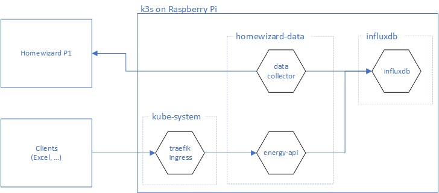
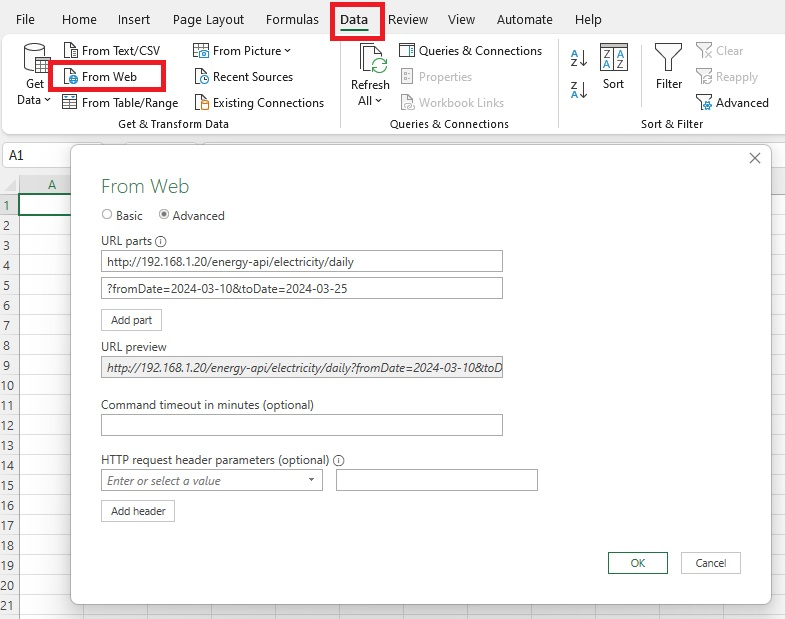
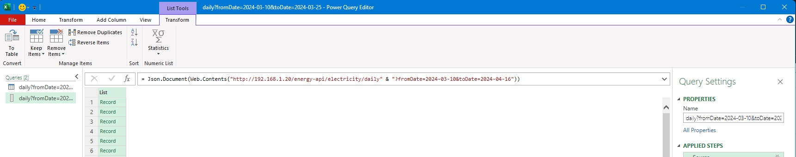
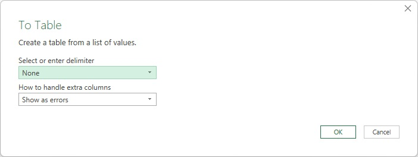
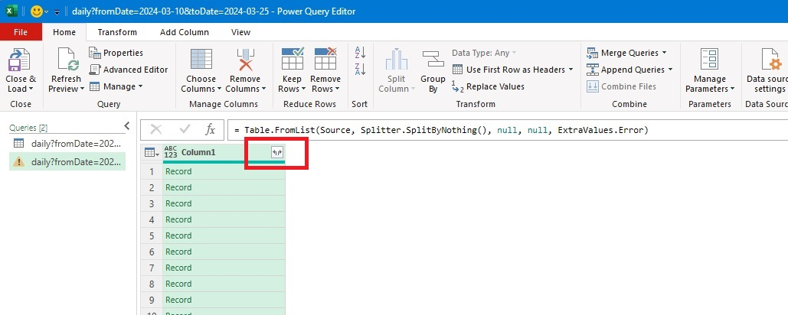
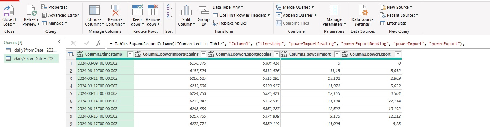

# Introduction

The 'homewizard-data' project collects and store energy consumption data (electricity, gas) that is collected by a Homewizard device for an extended period of time. This is done because the (free) Homewizard App only keeps track of the data from the last 12 months.
The data that is stored, is exposed via a simple API.

One of the goals of this project is to see the effect on my electricity bill should I have a home-battery.  This is done by using the stored electricity consumption and returned generated electricity data to simulate different scenario's in an Excel worksheet.  

# Components



A Homewizard P1 meter is reading out electricity power meter.
The `datacollector` component that is running in a kubernetes cluster is reading out the P1 meter on a timely interval and stores the readings in an `influxdb` database which is also running in the same kubernetes cluster (but in a different namespace).
The data that is stored in `influxdb` can be accessed via the `energy-api`. 
The `energy-api` is exposed via a `traefik` ingress which makes it possible that clients running outside the kubernetes cluster can access that API.

# How to use the collected data in Excel

With MS Excel, it is possible to retrieve data from a Web API.  This makes it possible to directly query the energy-api from Excel and import the returned data in the worksheet in a tabular format.

## Fetch data from the energy API

Fetch the data via the `From Web` option on the `Data` pane in Excel.



Enter the URL at which the API is listening, and make sure to specify the `fromDate` and `toDate` query parameters.
Traefik is configured to have an ingress for the API at `energy-api`, so the URL can look like this:

```
http://192.168.1.20/energy-api/electricity/daily?fromDate=2024-03-10&toDate=2024-04-16
```

After confirming the data source, a new dialog pops up that allows you to transform the data:



Click on the `To Table Convert` button, and specify that



Go with the default values; make sure that no delimiter is specified.

On the dialog that now appears, the data can be transformed:


Click on the button in the column-header that allows you to expand each record.  On the dialog that appears, select all columns and click OK.

You'll now see that that the data is available in a tabular format


The data can be loaded into Excel.  This is done by clicking on the 'Close & Load' button.

The data is now available in Excel and can be used to do all kind of calculations with it.

# Build and Deploy

Since this project consists of multiple components, a detailed description of how to deploy each specific component, can be found in a dedicated readme.md for every component:

- [Deploy InfluxDB](./influxdb/readme.md)

- [Data Retriever](./dataretriever/readme.md)

- [Energy API](./energy-api/readme.md)